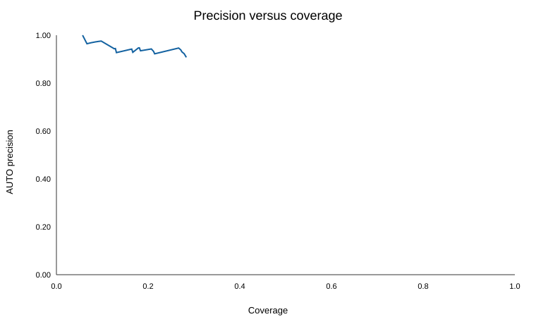
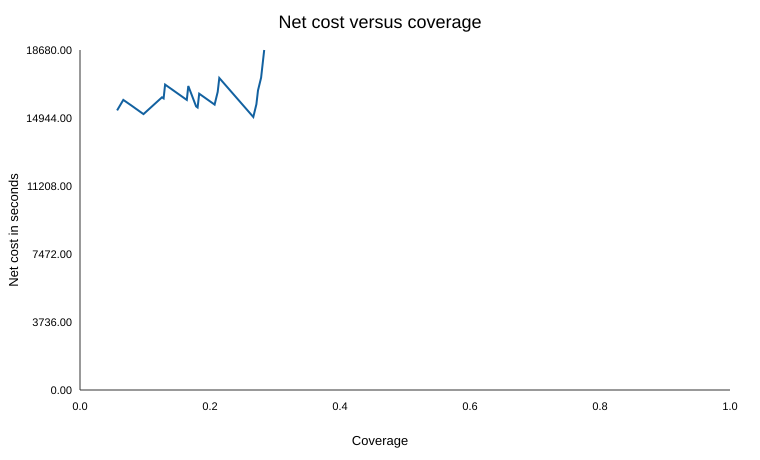

# Matcher Evaluation

## Status

The grouped training evaluation and 20-line error review are complete. The matcher configuration is frozen from training evidence. Holdout labels were not available and were not inferred.

## Method

Five grouped folds were used. Groups were formed from tenant and customer ID. A customer group was kept out of fitting and calibration when its rows were scored. Segments were created only from visible input fields.

A forced top-one accuracy is shown in the strategy table. It treats every line as if an answer had to be returned. This hides the cost of unsafe answers. Precision and coverage are therefore reported together. Net cost is used to compare safe points.

## Retrieval strategy comparison

| Strategy | Forced accuracy | Top-1 recall | Recall@3 | Mean candidates | p95 latency |
|---|---:|---:|---:|---:|---:|
| exact | 8.3% | 11.9% | 12.2% | 0.1 | 3.07 ms |
| rapidfuzz | 39.5% | 56.3% | 59.0% | 20.0 | 28.37 ms |
| word_tfidf | 59.5% | 84.7% | 93.6% | 17.9 | 12.53 ms |
| char_tfidf | 60.5% | 86.1% | 93.6% | 20.0 | 13.43 ms |
| hybrid | 60.0% | 85.4% | 92.2% | 20.0 | 40.52 ms |

This table measures retrieval. The hybrid lane was then tested end to end with the decision layer. Embeddings and LLMs were not used.

## Selected operating point

No point passed the Wilson uncertainty gate. The approved fallback was used. The selected point had 100% observed out-of-fold precision and no hard safety violation. Its small sample risk remains visible below.

- Confidence limit: `1.000`
- Margin limit: `0.000`
- Selection policy: `perfect_observed_small_sample`
- Bootstrap precision range: 100.0% to 100.0%
- Bootstrap coverage range: 2.8% to 9.6%

| Measure | Result |
|---|---:|
| Training rows | 420 |
| AUTO precision | 100.0% |
| AUTO precision lower bound | 86.2% |
| Coverage | 5.7% |
| Correct automatic matches | 24 |
| Wrong automatic matches | 0 |
| Net operating cost | 15,360 seconds |
| Abstentions | 396 |
| Blank-label refusal rate | 100.0% |
| Recall@3 on answerable rows | 93.2% |
| Recall@3 on reviewed rows | 92.6% |
| p95 matcher latency | 41.90 ms |

## Tenant results

| Group | Rows | Precision | Coverage | Wrong autos | Recall@3 | Cost |
|---|---:|---:|---:|---:|---:|---:|
| acme | 260 | 100.0% | 4.6% | 0 | 90.8% | 9,680 s |
| nordic | 160 | 100.0% | 7.5% | 0 | 96.7% | 5,680 s |

## Observable segment results

The segments describe signals that are available during matching. They do not use a hidden generator class.

| Group | Rows | Precision | Coverage | Wrong autos | Recall@3 | Cost |
|---|---:|---:|---:|---:|---:|---:|
| ambiguous_candidates | 34 | 0.0% | 0.0% | 0 | 76.9% | 1,360 s |
| identifier_present | 77 | 100.0% | 24.7% | 0 | 81.8% | 1,940 s |
| noisy_text | 27 | 100.0% | 3.7% | 0 | 100.0% | 1,020 s |
| non_item_like | 20 | 0.0% | 0.0% | 0 | 0.0% | 800 s |
| pack_or_uom | 183 | 100.0% | 1.1% | 0 | 97.3% | 7,200 s |
| plain_text | 75 | 100.0% | 2.7% | 0 | 100.0% | 2,880 s |
| sparse_text | 4 | 0.0% | 0.0% | 0 | 0.0% | 160 s |

## Reason-code results

| Group | Rows | Precision | Coverage | Wrong autos | Recall@3 | Cost |
|---|---:|---:|---:|---:|---:|---:|
| active_twin | 27 | 0.0% | 0.0% | 0 | 100.0% | 1,080 s |
| alias_current_unique | 10 | 100.0% | 100.0% | 0 | 100.0% | -200 s |
| alias_disabled_target | 33 | 0.0% | 0.0% | 0 | 69.7% | 1,320 s |
| alias_not_trusted | 8 | 0.0% | 0.0% | 0 | 100.0% | 320 s |
| attribute_conflict | 155 | 0.0% | 0.0% | 0 | 92.3% | 6,200 s |
| barcode_unique | 9 | 100.0% | 100.0% | 0 | 100.0% | -180 s |
| identifier_ambiguous | 2 | 0.0% | 0.0% | 0 | 100.0% | 80 s |
| low_confidence | 151 | 0.0% | 0.0% | 0 | 98.3% | 6,040 s |
| not_an_item | 20 | 0.0% | 0.0% | 0 | 0.0% | 800 s |
| text_high_margin | 5 | 100.0% | 100.0% | 0 | 100.0% | -100 s |

## Calibration

| Confidence bin | Rows | Mean confidence | Actual correctness |
|---|---:|---:|---:|
| 0.00-0.50 | 226 | 14.9% | 38.5% |
| 0.50-0.70 | 63 | 57.4% | 79.4% |
| 0.70-0.80 | 9 | 74.0% | 100.0% |
| 0.80-0.90 | 60 | 84.8% | 86.7% |
| 0.90-0.95 | 8 | 91.6% | 100.0% |
| 0.95-0.98 | 23 | 96.3% | 95.7% |
| 0.98-1.00 | 30 | 100.0% | 100.0% |

Probabilistic confidence comes from grouped calibration of the hybrid ranker. A unique safe identifier is a separate deterministic lane and is assigned 1.0 only after tenant, uniqueness, target-state, and conflict checks pass. Safety blocks and candidate margin remain separate from confidence.

## Regression gates

`evaluate.py` reads `analysis/regression_baseline.json` and exits non-zero when a quantitative or data-integrity gate fails:

- AUTO precision must remain 100% under the approved small-sample fallback.
- Coverage must remain at least 5%.
- No cross-tenant automatic match is allowed.
- No disabled, misc, or safety-blocked automatic match is allowed.
- p95 line latency must stay at or below 250 ms.
- Candidate recall@3 must remain at least 92.2%.
- Net cost must not exceed 15,360 seconds.
- The training-file hash must match the committed baseline.

If the Wilson gate cannot pass because the automatic sample is small, the approved fallback requires 100% observed out-of-fold precision. No wrong automatic match is allowed. Every safety and latency gate still applies. The Wilson result must still be reported.

The unit suite separately enforces determinism, output schema, tenant ownership, item state, and candidate limits. A data or policy change requires a reviewed baseline update. Production examples can be added after delayed labels arrive.

## Label-quality findings

Six supplied labels were found to be wrong or under-specified. They were not changed in primary metrics.

- `ACM-T-0114` — wrong false blank. The active catalogue contains one Stallion #10 x 1-inch stainless item. Text and price support ACM-SELF0720.
- `ACM-T-0130` — wrong false blank. The description exactly matches active item ACM-SELF0072, and the order price is close to list price.
- `ACM-T-0150` — wrong false blank. Description and packet UOM exactly match active item ACM-SELF0108, with supporting price evidence.
- `ACM-T-0182` — wrong false blank. Brand, 15mm size, and Class E identify ACM-PVCP0541; the other active variants are Class C or D.
- `ACM-T-0015` — wrong false blank. Brand, 7-inch size, and Flap grade identify ACM-ANGL0280; the other active grades are Cutting and Grinding.
- `NRD-T-0009` — under specified label. NRD-FULL0174 and NRD-FULL0174B are active twins with the same visible name, barcode, UOM, and price. No bulk evidence selects one.

Primary metrics still use the supplied labels.

## Manual error review

These 20 cases are genuine out-of-fold failures: every line is answerable and the supplied correct item was not ranked first. Each was checked against the order fields, catalogue, aliases, barcode, UOM, item state, and candidate evidence.

| Root-cause group | Lines | Count |
|---|---|---:|
| Variant parsing and tokenisation | `ACM-T-0002`, `ACM-T-0030`, `ACM-T-0043`, `ACM-T-0057`, `ACM-T-0084`, `ACM-T-0115`, `ACM-T-0209`, `ACM-T-0251` | 8 |
| Stale alias without a successor link | `ACM-T-0010`, `ACM-T-0011`, `ACM-T-0037`, `ACM-T-0051`, `ACM-T-0173`, `ACM-T-0200`, `ACM-T-0241`, `NRD-T-0065` | 8 |
| Ranking and retrieval tie | `ACM-T-0031`, `ACM-T-0185`, `ACM-T-0221`, `NRD-T-0030` | 4 |

The matcher abstained on all 20, so none became an 800-second wrong automatic match. They still cost review time and expose retrieval or ranking weaknesses. The actions below target shared causes rather than individual lines.

| Line | Label finding | Root cause | Cost class | Action |
|---|---|---|---|---|
| `ACM-T-0002` | correct label | The split text 'C lass E' prevents reliable grade extraction. The Class C, D, and E variants receive the same score and item-code order puts Class C first. | review 40 seconds top candidate wrong | Repair split grade tokens before retrieval and score an extracted class as a required variant attribute. |
| `ACM-T-0030` | correct label | The text joins 'Pipe' to the size and splits 15mm as '1 5mm'. The size parser loses 15mm, leaving several Hitex Class E pipes tied. | review 40 seconds top candidate wrong | Add bounded token repair for split numeric dimensions after a recognised product family. |
| `ACM-T-0043` | correct label | The misspelling 'Cass E' is not normalised to Class E. Price similarity then favours the wrong Class C variant. | review 40 seconds top candidate wrong | Normalise common grade misspellings and make an extracted grade conflict outweigh price similarity. |
| `ACM-T-0057` | correct label | Both the brand and size are damaged: 'Hietx' and '300m' instead of Hitex and 300mm. Generic cable-tie text retrieves the right family but ranks another brand first. | review 40 seconds top candidate wrong | Use a tenant brand lexicon for conservative typo repair and treat 300m as a likely millimetre typo only within the cable-tie family. |
| `ACM-T-0084` | correct label | The range and material are split as '19-25m mSS304', and Kanto is typed as Kato. The matcher keeps the correct family and size but ranks the Zinc variant above SS304. | review 40 seconds top candidate wrong | Repair split millimetre and material tokens before structured comparison and use conservative brand correction. |
| `ACM-T-0115` | correct label | Slash-heavy text and the fractional inch mark prevent the #10 by 1-1/2 inch dimensions from separating cleanly. Multiple zinc-plated screws tie at the top. | review 40 seconds top candidate wrong | Parse screw gauge and fractional length before punctuation normalisation. |
| `ACM-T-0209` | correct label | The line gives product, width, and grade but omits brand and bulk status. Several active 24mm high-temperature tapes are equally compatible, so item-code order selects Kanto instead of the labelled Tolsen bulk row. | review 40 seconds top candidate wrong | Keep this class in review and require brand or a trusted customer identifier; code cannot infer the omitted bulk variant safely. |
| `ACM-T-0251` | correct label | The 1-1/4 inch fraction is not distinguished strongly enough from 1 inch. The outer-price note also makes raw price comparison unsuitable. | review 40 seconds top candidate wrong | Canonicalise mixed fractions and apply pack conversion before using a price feature. |
| `ACM-T-0010` | correct label | The trusted buyer SKU points to ACM-GIWI0811-OLD, but the data has no explicit successor link. The visible text omits wire gauge, so active #16 and #18 variants cannot be separated. | review 40 seconds top candidate wrong | Request an explicit supersedes relation and migrate the alias after approval; do not infer a successor from the code suffix. |
| `ACM-T-0011` | correct label | The buyer SKU points to the disabled 7-inch item while the text omits disc size. Active grinding discs tie across sizes. | review 40 seconds top candidate wrong | Repair the stale alias through a catalogue successor mapping; keep review until the mapping is confirmed. |
| `ACM-T-0037` | correct label | The alias identifies a disabled 3/4-inch SS304 valve, while the visible text contains neither size nor material. Lexical ranking has no evidence for the active replacement. | review 40 seconds top candidate wrong | Use a vendor-supplied successor relation to repair the alias; no text-only rule can select the replacement safely. |
| `ACM-T-0051` | correct label | The stale alias contains the missing Yellow attribute, but its target is disabled. The order text only says Kanto Helmet Ratchet, leaving colour variants tied. | review 40 seconds top candidate wrong | Preserve the block and add an audited old-to-new item mapping before transferring the alias. |
| `ACM-T-0173` | correct label | The text fixes the 3/4-inch size but omits material. The stale alias points to the disabled SS304 row, while lexical evidence ranks the active PVC variant first. | review 40 seconds top candidate wrong | Require an explicit successor mapping for the stale alias; material must not be copied from a disabled target without that contract. |
| `ACM-T-0200` | correct label | The order text omits both product detail and helmet colour. The disabled alias contains the missing Yellow variant, so active helmet colours remain tied after the alias is blocked. | review 40 seconds top candidate wrong | Repair the alias through a confirmed successor mapping and otherwise keep human review. |
| `ACM-T-0241` | correct label | The line contains brand and 7-inch size but omits Grinding. The stale alias points to the disabled Grinding row, and the active Flap row ranks first on visible text. | review 40 seconds top candidate wrong | Use a maintained successor relation to recover the grade; do not let a disabled alias silently fill an omitted attribute. |
| `NRD-T-0065` | correct label | The stale alias points to the disabled 2kg item, while the visible line omits pack size. Price is close for both 1kg and 2kg rows and ranks 1kg first. | review 40 seconds top candidate wrong | Transfer the alias only through an explicit old-to-new mapping and keep pack-ambiguous text in review. |
| `ACM-T-0031` | correct label | The single-letter glove size S is not weighted as a structured size. Small, medium, and large blue Bosco gloves tie and catalogue order puts L first. | review 40 seconds top candidate wrong | Extract S, M, L, and XL only inside size-bearing product families and require exact size agreement. |
| `ACM-T-0185` | correct label | A 0.55-confidence alias points to the labelled Kanto Yellow helmet, but it is too weak for automatic use and contributes too little to ranking. Generic helmet text ranks unrelated brands above it. | review 40 seconds top candidate wrong | Let weak aliases improve candidate ranking while retaining the automatic-match block until independent attributes confirm the target. |
| `ACM-T-0221` | correct label | The line explicitly contains Class C, but Class C and Class E candidates receive equal scores. Item-code order places Class E first. | review 40 seconds top candidate wrong | Represent PVC class as a structured categorical feature instead of relying on general token similarity. |
| `NRD-T-0030` | correct label | Halberg is misspelled as Hablerg. Product form and pack match several brands, and price similarity incorrectly moves Fjordal above the labelled Halberg row. | review 40 seconds top candidate wrong | Apply conservative matching against the tenant brand lexicon before price contributes to ranking. |

The detailed evidence is kept in `analysis/evaluation/manual_review_20.md`.

## Limits

- Only 420 labelled rows were available.
- The confidence ranges remain wide for small automatic-match lanes.
- Alias history was treated as supplied reference data.
- No production traffic or delayed outcome labels were available.
- The holdout set was not used for fitting, limits, or report numbers.
